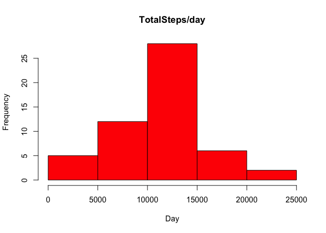
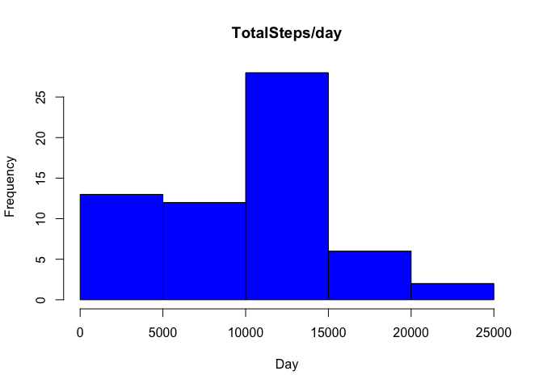
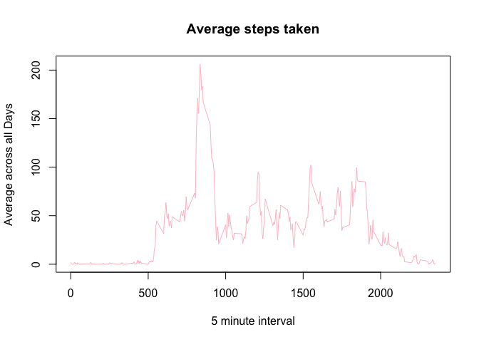
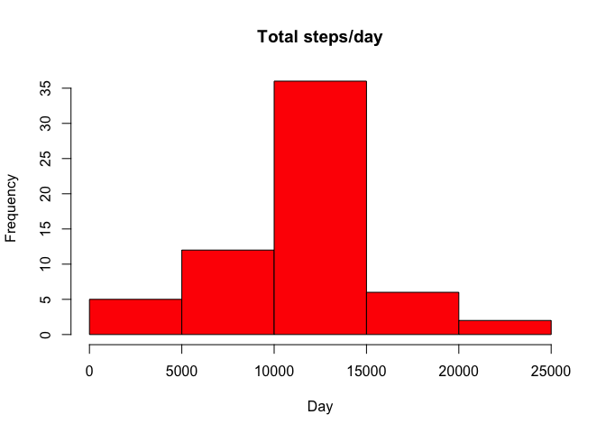
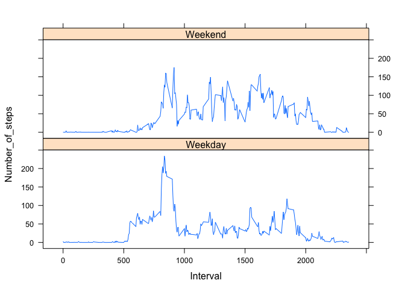

# Reproducible Research: Peer Assessment 1
## Loading and preprocessing the data

```
##   steps       date interval
## 1    NA 2012-10-01        0
## 2    NA 2012-10-01        5
## 3    NA 2012-10-01       10
## 4    NA 2012-10-01       15
## 5    NA 2012-10-01       20
## 6    NA 2012-10-01       25
```

```
## [1] "steps"    "date"     "interval"
```

```
##       steps       date interval
## 17563    NA 2012-11-30     2330
## 17564    NA 2012-11-30     2335
## 17565    NA 2012-11-30     2340
## 17566    NA 2012-11-30     2345
## 17567    NA 2012-11-30     2350
## 17568    NA 2012-11-30     2355
```

```
## 'data.frame':	17568 obs. of  3 variables:
##  $ steps   : num  NA NA NA NA NA NA NA NA NA NA ...
##  $ date    : chr  "2012-10-01" "2012-10-01" "2012-10-01" "2012-10-01" ...
##  $ interval: num  0 5 10 15 20 25 30 35 40 45 ...
```
## What is mean total number of steps taken per day?

```r
TotalSteps <- aggregate(steps ~ date, data = steps_data, sum, na.rm = TRUE)
hist(TotalSteps$steps, main = "TotalSteps/day", xlab = "Day", col = "red")
```

 

```r
mean(TotalSteps$steps)
```

```
## [1] 10766.19
```

```r
median(TotalSteps$steps)
```

```
## [1] 10765
```

```r
steps <- rep(NA, 61)
day <- rep("NA", 61)
steps_day <- tapply(steps_data$steps, steps_data$date, sum, na.rm = T)
length(steps_day)
```

```
## [1] 61
```

```r
for (i in 1:length(steps_day)) {
  steps[i] <- steps_day[[i]]
  day[i] <- names(steps_day)[i]
}

day_n_steps<- data.frame(day, steps)
head(day_n_steps,n=3)
```

```
##          day steps
## 1 2012-10-01     0
## 2 2012-10-02   126
## 3 2012-10-03 11352
```

```r
hist(day_n_steps$steps, main = "TotalSteps/day", xlab = "Day", col = "blue")
```

 

## What is the average daily activity pattern?

```r
TimeSeries <- tapply(steps_data$steps, steps_data$interval, mean, na.rm = TRUE)

plot(row.names(TimeSeries), TimeSeries, type = "l", xlab = "5 minute interval", 
     ylab = "Average across all Days", main = "Average steps taken", 
     col = "pink")
```

 

```r
MaxInterval <- which.max(TimeSeries)
names(MaxInterval)
```

```
## [1] "835"
```

## Imputing missing values
Search for NA and if its an NA value, replace it with Steps average.

```r
steps_data_NA <- sum(is.na(steps_data))
steps_data_NA
```

```
## [1] 2304
```

```r
AverageSteps <- aggregate(steps ~ interval, data = steps_data, FUN = mean)
fill_NA <- numeric()
for (i in 1:nrow(steps_data)) {
  obsn <- steps_data[i, ]
  if (is.na(obsn$steps)) {
    steps <- subset(AverageSteps, interval == obsn$interval)$steps
  } else {
    steps <- obsn$steps
  }
  fill_NA <- c(fill_NA, steps)
}
steps_data_new <- steps_data
steps_data_new$steps <- fill_NA
TotalSteps2 <- aggregate(steps ~ date, data = steps_data_new, sum, na.rm = TRUE)
hist(TotalSteps2$steps, main = "Total steps/day", xlab = "Day", col = "red")
```

 

```r
mean(TotalSteps2$steps)
```

```
## [1] 10766.19
```

```r
median(TotalSteps2$steps)
```

```
## [1] 10766.19
```


## Are there differences in activity patterns between weekdays and weekends?

```r
day <- weekdays(steps_data$date)
daylevel <- vector()
for (i in 1:nrow(steps_data)) {
  if (day[i] == "Saturday") {
    daylevel[i] <- "Weekend"
  } else if (day[i] == "Sunday") {
    daylevel[i] <- "Weekend"
  } else {
    daylevel[i] <- "Weekday"
  }
}
steps_data$daylevel <- daylevel
steps_data$daylevel <- factor(steps_data$daylevel)
StepsByDay <- aggregate(steps ~ interval + daylevel, data = steps_data, mean)
names(StepsByDay) <- c("interval", "daylevel", "steps")
xyplot(steps ~ interval | daylevel, StepsByDay, type = "l", layout = c(1, 2), 
       xlab = "Interval", ylab = "Number_of_steps")
```

 
